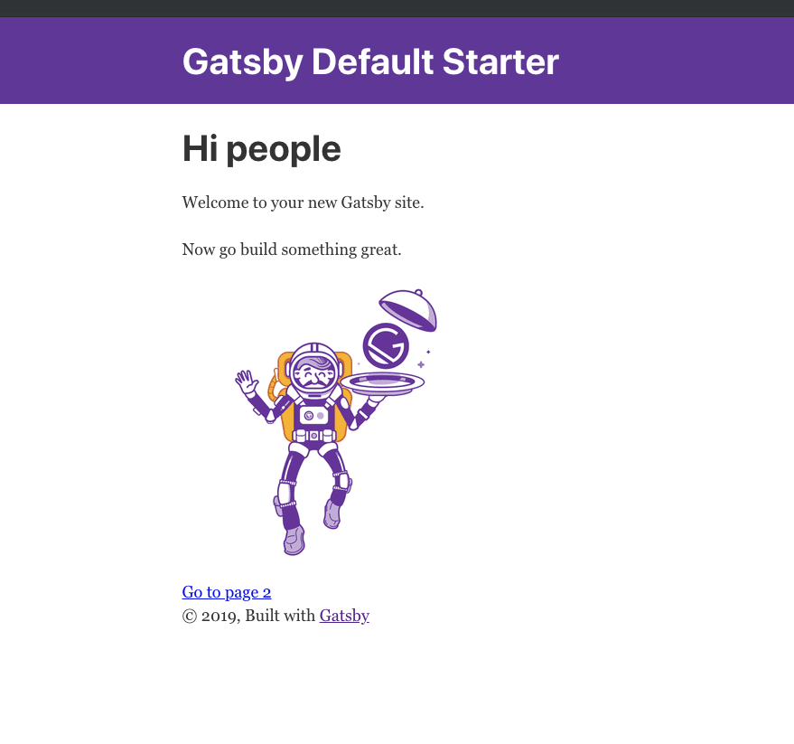
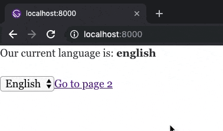
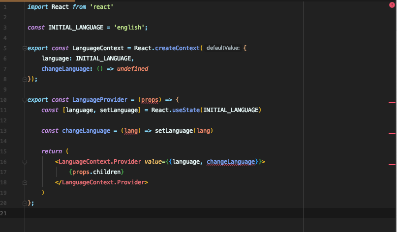

> Uncaught TypeError: Cannot read property 'welcomeToJavascript' of undefined 

Yes, we've all seen this infamous message one way or another. Wouldn't it be fantastic if we could catch such errors before we even execute our program? 

*Enter Typescript*

Typescript is a superset of JavaScript that will let us write our code in a type-safe way. Now, I will not be doing a deep dive on Typescript, as there are already quite a few articles for such endeavors at your disposal.

In this post we'll walk through creating a simple Gatsby project, creating our own plugin, and then converting the plugin to use Typescript. Gatsby is a popular framework for creating static web sites. By static, I mean rendering `page1.html, page2.html, page3.html, etc` on your server, versus something like `myHipsterTrendingSPA.html` that injects a javascript application and such. I like to associate a static website with semantic HTML. As in `<a href="/page2.html">Next</a>` will, in fact, direct you to that file's location.

Why Gatsby over just dumping your files onto a server? Gatsby let's you write JavaScript, specifically React, to create your static pages. Additionally, you get a rich plugin ecosystem, the capacity to use your fancy bundlers and loaders, and excellent documentation. Simply, it allows you to focus on solving your problems at hand, whether it's a CMS or a blog. Now (again), this article aims *not* and delve into its internals.  

In aiming to convert my own Gatsby plugin to TypeScript, I struggled looking for gatsby-plugins that had TypeScript support (checking the sourcecode or if they exposed an `index.d.ts` file) to serve as reference. Ultimately, such a task wasn't too burdening and hence, here we are.

## The Plugin

We're going to create a new plugin called **gatsby-language-chooser-plugin**. This plugin allows us to access a language, as well as update it, at any time. It makes use of React's `context` api and Gatsby's `wrapRootElement` api.

//TODO PUT NPM INSTALLATION HERE

We edit files in `/src` and compile the files into vanilla JavaScript at the root so the Gatsby plugin reconciler can find them. More info on this here. Note, using a JavaScript transpiler/compiler is *optional*; you can very well write vanilla JavaScript directly on the root directory.

Let's take a look at our source files:

**src/languageProvider.jsx**
```javascript
import React from 'react'

const INITIAL_LANGUAGE = 'english';

export const LanguageContext = React.createContext({
    language: INITIAL_LANGUAGE,
    changeLanguage: () => undefined
});

export const LanguageProvider = (props) => {
    const [language, setLanguage] = React.useState(INITIAL_LANGUAGE)

    const changeLanguage = (lang) => setLanguage(lang)

    return (
        <LanguageContext.Provider value={{language, changeLanguage}}>
            {props.children}
        </LanguageContext.Provider>
    )
};
```
We'll expose a provider that manages the `language` of our application, and the `changeLanguage` function that allows us to change the language to whatever string we pass it - as in `changeLanguage('Spanish')`. For a deep dive on context, check out the [React official docs](https://reactjs.org/docs/context.html).

**src/gatsby-browser.jsx**
```jsx
import React from 'react'
import { LanguageProvider } from './languageProvider';

export const wrapRootElement = ({element}) => (
    <LanguageProvider>
        {element}
    </LanguageProvider>
);
```
We'll utilize a Gatsby-specific API [`wrapRootElement`](https://www.gatsbyjs.org/docs/browser-apis/#wrapRootElement) to wrap our application with our `languageProvider`. This means our Gatsby application will have access to our language API at any given point. Perfect for, say, showing the ability to toggle the language in a footer or header at any point while a user is on our website.

**src/index.js**
```javascript
import { LanguageContext } from './languageProvider'

export {
  LanguageContext
}
```
We'll need a way to actually use our context in our app. So, we'll expose the `LanguageContext` in an `index` file.

In order for Gatsby to understand our plugin, we'll need to do two things:

1. Put our files from `/src` into the `root` directory of our plugin.
2. Compile our `es6` JavaScript into plain, vanilla JavaScript.

We can setup Babel to do both of these things. First let's install some development packages:

`$ yarn add -D @babel/cli @babel/core babel-preset-gatsby-package`

This will allow us to run a babel script from the command line that will put our code into something that Gatsby understands.

Let's add a `.babelrc` file to the root of our project:

**.babelrc**
```javascript
{
  "presets": [
    [
      "babel-preset-gatsby-package",
      {
         // remember, we're utilizing the `gatsby-browser` function `wrapRootElement`
         // this property ensures our compiled code will be browser-friendly
        "browser": true 
      }
    ]
  ]
}
```

Last, let's make our lives easier by adding a script to `package.json` that will put the files from `/src` into the root directory

**package.json**
```json
"scripts": {
    "build": "babel src --out-dir .", // highlight-line
  },
```

Ok let's try it out! Run `$ yarn build`
```none
yarn run v1.12.3
$ babel src --out-dir .
Successfully compiled 3 files with Babel.
✨  Done in 2.13s.
```

Your directory should now look like this:

```none
- src
    - index.js
    - languageProvider.jsx
    - gatsby-browser.jsx
- package.json
- .babelrc
- index.js
- languageProvider.js
- gatsby-browser.js
```

We'll test our plugin locally by installing it in a sample gatsby project. 

Let's clone down a gatsby starter repo. Make sure not to run this in the same place as the plugin we made.

`$ git clone https://github.com/gatsbyjs/gatsby-starter-default.git gatsby-site`

Let's change into this new directory we made and make sure everything is up and running:

`$ cd gatsby-site`

`$ yarn develop`

Let's navigate to localhost:8000 to make sure things are running smoothly:



We're ready to install and start using our language plugin. To run a local plugin, we have to put our package in a folder called `plugins` inside our gatsby project. Check the [docs](https://www.gatsbyjs.org/docs/creating-a-local-plugin/) if you want more info on this.

Our directory structure should look like this:
```none
- node_modules
- public
- plugins // Create this folder
    // make sure you use this exact name - we'll need it later
    // this is the plugin we made earlier
    // copy it over or move it and rename it if you have to
    - gatsby-plugin-language-chooser 
        - src
            - index.js
            - languageProvider.jsx
        - index.js
        - languageProvider.js
- src
```

We'll now configure it in `gatsby-config.js`

**gatsby-config.js**
```javascript
module.exports = {
  plugins: [
     // notice the name is the same as our package in the plugin folder
     // gatsby under the hood is utilizing our naming to incorporate our local plugins 
     // into all the plugins we registered
     `gatsby-language-chooser-plugin` 
  ],
}
```

Ok, that was a lot of steps! Before we go further, run `$ yarn develop` to make sure everything is still working.

Let's finally use our plugin!

We're going to replace all the code in our landing page with a simple interface that will do two things:

1. Show the current language
2. Allow the user to change the language

Replace `src/pages/index.js` with the following:

**src/pages/index.js**
```jsx
import React from "react"
import { LanguageContext } from '../../plugins/gatsby-plugin-language-chooser'

const IndexPage = () => {
  const languageContext = React.useContext(LanguageContext)

  const onChangeLanguage = (e) => {
    languageContext.changeLanguage(e.target.value)
  }

 return (
   <div>
    <p>Our current language is: <strong>{languageContext.language}</strong></p>

    <select onChange={onChangeLanguage}>
      <option value="english">English</option>
      <option value="spanish">Spanish</option>
      <option value="french">French</option>
      <option value="german">German</option>
    </select>
    
    <Link to="/page-2">Go to page 2</Link>
   </div>
 )
}

export default IndexPage
```

Replace `src/pages/page-2.js` with the following:

**src/pages/page-2.js**
```jsx
import React from "react"
import { LanguageContext } from '../../plugins/gatsby-plugin-language-chooser'
import { Link } from "gatsby"

const IndexPage = () => {
  const languageContext = React.useContext(LanguageContext)

  return (
    <div>
      <p>Page 2 and our language still is: <strong>{languageContext.language}</strong></p>
      <Link to="/">Go back to the homepage</Link>
    </div>
  )
}

export default IndexPage
```

Navigate to your browser and you should see our plugin working it its magic:



And that's it, our application now can track across all its pages what language we're using thanks to our plugin. The user doesn't have to manage any of the state or functionality.

If any of this setup seems strange to you, definitely check our the [Gatsby docs](https://www.gatsbyjs.org/docs/quick-start).

Great, we've got our Gatsby plugin with a test installation up and running. We have the implementation all set, so let's try to make the plugin type-safe without changing the public-facing API whatsoever. In theory, all we should have to do is install the plugin after the conversion and it should work exactly the same as before. However, if the Gatsby project itself was using TypeScript, it would be able to make use of our type definitions, allowing us to use the plugin properly as well as prevent bugs before ever getting to runtime.

## The Conversion

We'll be doing the rest of the work in our local plugin, so make you are in the right directory. From the root of your gatsby project:

`$ cd plugins/gatsby-plugin-language-chooser`

Let's start by installing Typescript:

`$ yarn add -D typescript`

Well need to add a `tsconfig.json` to tell the compiler how to check our code and compile it.

Add to the root of your plugin folder a `tsconfig.json` file

**tsconfig.json**
```json
{
  "compilerOptions": {
    "target": "es5",
    "lib": [
      "dom",
      "es6"
    ],
    "sourceMap": true,
    "jsx": "react",
    "noUnusedLocals": true,
    "forceConsistentCasingInFileNames": true,
    "noImplicitThis": true,
    "noImplicitAny": true,
    "strictNullChecks": true,
    "declaration": true,
    "declarationMap": true,
    "allowSyntheticDefaultImports": true,
    "strict": true,
    "typeRoots": [
      "./node_modules/@types"
    ],
    "types": [
      "node"
    ],
    "esModuleInterop": true,
    "noEmit": false,
    "noEmitOnError": true,
    // outDir will put the compiled javascript files in our root directory
    // just as we were doing before with our babel compilation
    "outDir": ".", 
    "skipLibCheck": true
  },
  "include": [
    "./src/**/*"
  ],
  "exclude": [
    "./node_modules/*"
  ]
}
```

I'm not going to cover what each config property means in this post. Check the [Typescript docs](https://www.typescriptlang.org/) for a deeper dive. 

We're now ready to convert our existing `js` and `jsx` files into `ts` and `tsx` files.

Change `src/languageProvider.jsx` -> `src/languageProvider.tsx`

If you're using an IDE like Jetbrains or Visual Studio, you'll probably already start to see a ton of Typescript errors. Don't fret! This is actually a very good thing. We're getting told our code isn't *type-safe*. This means we might encounter `null` or `undefined` at runtime like we talked about at the very beginning; this would lead to poor user experience if our application started misbehaving and not working. 



In our case, we enabled `strict` mode in our `tsconfig.json` file, so our code won't even compile until we fix all the Typescript errors. Again, this is awesome because this let's us squash bugs before the code even get's interpreted by the browser.

Ok, let's make `languageProvider.tsx` type-safe:

**languageProvider.tsx**
```typescript
import React from "react"

// we'll make the contract for our props
// that our Provider gets passed in
interface Props {
  children: React.ReactNode;
}

// we'll define the shape of our plugin's api in this interface
interface LanguageManager {
  language: string;

  changeLanguage(lang: string): void;
}

const INITIAL_LANGUAGE = "english"

// we'll create a default state for our context and type it to be
// LanguageManager, so typescript will ultimately know the provider needs
// these specific properties
const defaultState: LanguageManager = {
  language: INITIAL_LANGUAGE,
  changeLanguage: () => undefined,
}

export const LanguageContext = React.createContext(defaultState)

// we can type our props getting passed in now
// most editors will be able to give us type-hints and look-aheads
export const LanguageProvider = (props: Props) => {
  // typescript will actually infer that language is a string here
  // and is pretty good at inferring the rest of our code in this file
  const [language, setLanguage] = React.useState(INITIAL_LANGUAGE)
  
  const changeLanguage = (lang: string) => setLanguage(lang)

  return (
    <LanguageContext.Provider value={{ language, changeLanguage }}>
      {props.children}
    </LanguageContext.Provider>
  )
}
```

Ok, my IDE says it's okay. But let's actually make sure our code can compile as a sanity check.

Open up `package.json` and change the build script to:

`"build": "tsc -b"` 

Running `yarn build` should yield us:

```markdown
yarn run v1.12.3
$ tsc -b
✨  Done in 6.97s.
```

You'll see we now have a `languageProvider.js` file in the root directory, just as we did before, which is excellent because our plugin's api should work just the same as it did before. You'll also notice we have some `.map` files and a `.d.ts` file. 

The map files are source maps, which we enabled in our `tsconfig` file. Source maps help us and other developers debug and trace problems in our code because it allows us to read the human-readable authoring rather than the jarbled code after it goes through processing (due to our babel and now typescript compilation steps).

The `.d.ts` are typescript definition files. These let us communicate the shapes and contracts of our code. Type definition files are extremely useful for using other people's packages. For example, if someone were to use our plugin and had Typescript installed, they would get access to typehints in their editor, as well as compiler checks. Invoking say, `changeLanguage(10)` would make the compiler weep.

Before we convert our other files, let's make our code a bit more robust. 

Right now, we can set our language to any language we want because we type it to any measly old string. As in `changeLanguage('banana')`. Let's be more strict by only allowing actual languages.

Let's update `languageProvider.tsx`:

**languageProvider.tsx**
```typescript
import React from "react"

interface Props {
  children: React.ReactNode;
}

// we'll use an algebraic type that says anything of type Language
// can only be one of the following strings
type Language = 'english' | 'spanish' | 'french' | 'german';

interface LanguageManager {
  // language can now only be a language and not a string
  language: Language;

  // now changeLanguage can only accept a Language as a parameter
  changeLanguage(lang: Language): void;
}

// we can even type the initial language constant to Language
const INITIAL_LANGUAGE: Language = "english"

const defaultState: LanguageManager = {
  language: INITIAL_LANGUAGE,
  changeLanguage: () => undefined,
}

export const LanguageContext = React.createContext(defaultState)

export const LanguageProvider = (props: Props) => {
  // unfortunately, Typescript isn't smart enough to completely infer
  // the type that our language can be in our state
  // useState takes a type parameter that we can pass it
  const [language, setLanguage] = React.useState<Language>(INITIAL_LANGUAGE)

  // we can make sure that the implementation of changeLanguage only
  // takes in a Language and not any old string
  const changeLanguage = (lang: Language) => setLanguage(lang)

  return (
    <LanguageContext.Provider value={{ language, changeLanguage }}>
      {props.children}
    </LanguageContext.Provider>
  )
}
```

Let's run `$ yarn build` for a quick sanity check:

```markdown
yarn run v1.12.3
$ tsc -b
✨  Done in 5.67s.
```

Ok great, now users who try to use `changeLanguage('apple')` should see a typescript error.

Let's convert the rest of our files in `src` to typescript.

`src/gatsby-browser.jsx` -> `src/gatsby-browser.tsx`

**src/gatsby-browser.tsx**
```typescript
import React from 'react'
import { LanguageProvider } from './languageProvider';

// we'll make an interface based on Gatsby's wrapRootElement api
interface GatsbyRootProps {
    element: React.ReactNode;
}

export const wrapRootElement = (props: GatsbyRootProps) => (
    <LanguageProvider>
        {props.element}
    </LanguageProvider>
);
```

Last, change `src/index.js` -> `src/index.ts`

We actually don't have to make any changes here! Changing the filename will allow the Typescript compiler to make a type definition file for our index, which is pretty important because this is the main file where we expose our api.

Let's run one more `$ yarn build` and you should now see all the `*.map` and `.d.ts` files alongside your compiled `.js` files.

To test that our plugin still works, let's navigate back to the root of our gatsby project and run `$ yarn develop`.

Check out localhost:8000 and you should see our plugin still works like a charm!

Now to get the full effect of typescript would be to have the blog itself use typescript, which I will not be covering in this post.

However, in theory a Gatsby project with typescript would *not* be able to run `languageContext.changeLanguage('orange')` or ` languageContext.changeLanguage(24)`.

## In Closing

We covered a lot of ground in this post. We created a Gatsby project, created a Gatsby plugin, and converted that plugin to Typescript. Not bad, I'd say.

You can find all the sample code [here](link) and please raise an issue if you run into any problems.

I think the Gatsby community would benefit greatly if more of their own internal api, plugins, and community plugins were backed by Typescript. We get reliable contracts to the code we write and use that inherently promotes developer ergonomics and continuity.
    
