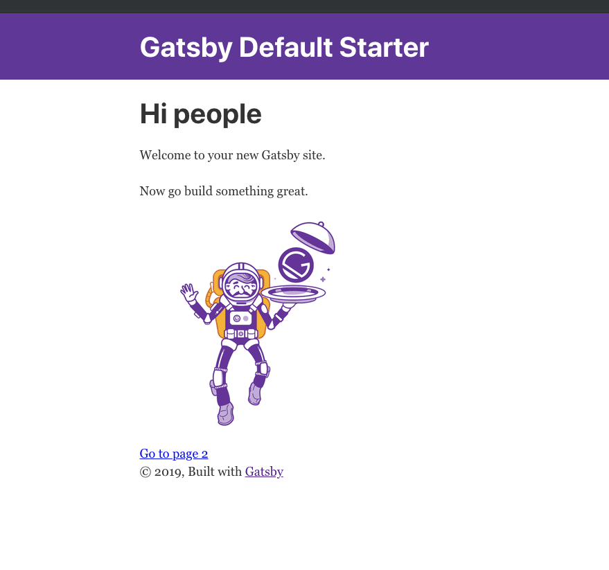
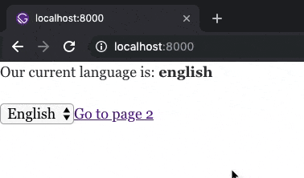

In aiming to convert my own Gatsby plugin to use Typescript, I struggled looking for "the right way" to incorporate it - I was mostly checking the sourcecode of official and popular plugin repos.

For those of you with similar toils, look no further. We'll walk through step-by-step in creating a simple Gatsby project, creating our own local plugin for Gatsby, and then converting that plugin to use Typescript.

We're in neither [East nor West Egg](https://en.wikipedia.org/wiki/The_Great_Gatsby) here. I'm talking about [Gatsby](https://www.gatsbyjs.org/) - a framework for statically built websites.

What does it mean for a website to be *static*? A static sites serves up `page1.html, page2.html, page3.html` **separately** versus something like `myHipsterTrendingSPA.html` that injects a Javascript application on **one single page**. I like to associate a static website with semantic HTML. As in `<a href="/page2.html">Go to page 2</a>` will, in fact, direct you to that file's location on your server.

Gatsby lets you write Javascript, specifically [React](https://reactjs.org/), to create your static pages. Additionally, you get a rich plugin ecosystem, the capacity to use your fancy bundlers and loaders (like [webpack](https://webpack.js.org/)), and excellent documentation. It also harnesses [GraphQL](https://graphql.org/) to do some neat work behind the scenes to talk to databases and other servers or file parsing (we won't dabble into this in our project). Simply, it allows you to focus on solving the problems at hand, whether it's a CMS or a blog. 

Now let's talk about using Typescript in our Gatsby project. What's the big deal?

If you've used Javascript in any realm, you've seen this one way or another:

> Uncaught TypeError: Cannot read property 'welcomeToJavascript' of undefined 

What if we could prevent our eyes from seeing such horrors?

**Typescript to the rescue.**

[Typescript](https://www.typescriptlang.org/) is a superset of Javascript that lets us write our code in a type-safe way.

 Type-safety let's us know ahead of time if our code is correct or not. It gives us hope that we will not get an error like the one above at runtime. We also get a pretty smart compiler that will (in most cases) not even build our code if it sees us trying to access `null` or trying to reassign `"burrito"` to `42`. It's a tool that will help us catch and prevent bugs earlier and also provides nice documentation through the **interfaces** we write in our code.

## Let's Build

Before we get started, make sure you have [node](https://nodejs.org/en/) installed and, optionally, [yarn](https://yarnpkg.com/en/) (I use yarn in the examples for command-line executions).

---

Ok, let's do this thing!

To reiterate, our plan of attack will be:

1. Create a simple Gatsby website
2. Create a plugin for our gatsby site
    - The plugin will live locally in the project
3. Convert the plugin to Typescript

---

First, let's clone down a gatsby starter repo. We'll use the default starter.

`$ git clone https://github.com/gatsbyjs/gatsby-starter-default.git gatsby-site`

Let's change into the directory and make sure everything is up and running:

`$ cd gatsby-site`

`$ yarn develop`

Navigate to *localhost:8000* to make sure things are running smoothly:



Not too bad, right?

---

We're ready to build a plugin for our site. Just as it sounds, Gatsby plugins let us add cool little features to our site without encumbering our main code. 

We'll put our plugin in a folder called `plugins` inside our Gatsby project. 

We're going to create  **gatsby-language-chooser-plugin**. This plugin allows us to access a language, as well as update it, at any time. It makes use of React's [context](https://reactjs.org/docs/context.html) api and Gatsby's [wrapRootElement](https://www.gatsbyjs.org/docs/browser-apis/#wrapRootElement) api.

First create a `plugins` folder and inside that, create a folder named `gatsby-plugin-language-chooser`. This is where the code for our plugin will go.

Our directory structure should look like this:
```javascript
- node_modules
- public
// highlight-start
// Create these folders
- plugins
    // make sure you use this exact name - we'll need it later
    - gatsby-plugin-language-chooser
// highlight-end
- src
```

Let's change into our plugin's directory:

`$ cd plugins/gatsby-plugin-language-chooser`

Initialize an npm package by running:

`$ npm init`

You can hit enter for everything to get all the defaults or feel free to get fancy.

In our plugin, we'll write our source code in `/src` and compile the files into vanilla Javascript at the root so the Gatsby plugin reconciler can find them. 

Using a Javascript transpiler/compiler is **optional**; you can very well write vanilla Javascript directly at the root level of the plugin folder.

Ok, let's write some code.

**src/languageProvider.jsx**
```javascript
import React from 'react'

const INITIAL_LANGUAGE = 'english';

export const LanguageContext = React.createContext({
    language: INITIAL_LANGUAGE,
    changeLanguage: () => undefined
});

export const LanguageProvider = (props) => {
    const [language, setLanguage] = React.useState(INITIAL_LANGUAGE)

    const changeLanguage = (lang) => setLanguage(lang)

    return (
        <LanguageContext.Provider value={{language, changeLanguage}}>
            {props.children}
        </LanguageContext.Provider>
    )
};
```

Here, we expose a *provider* that manages the `language` of our application and the `changeLanguage` function that allows us to change the language to whatever *string* we pass it - as in `changeLanguage('Spanish')`. 

**src/gatsby-browser.jsx**
```jsx
import React from 'react'
import { LanguageProvider } from './languageProvider';

export const wrapRootElement = ({element}) => (
    <LanguageProvider>
        {element}
    </LanguageProvider>
);
```
We'll utilize a Gatsby-specific API `wrapRootElement` to wrap our application with our `LanguageProvider`. This means our Gatsby app will have access to our language API at any given point - perfect for showing the ability to toggle the language in a footer or header at any point on our website.

**src/index.js**
```javascript
import { LanguageContext } from './languageProvider'

export {
  LanguageContext
}
```
We'll need a way to actually use the context in our app. So, we'll expose the `LanguageContext` in an `index` file.

---
In order for Gatsby to understand our plugin, we'll need to do two things:

1. Compile our `es6` Javascript into plain, vanilla Javascript.
2. Specify where the files will go.

We can setup [Babel](https://babeljs.io/) to do both of these things. First let's install some packages:

`$ yarn add -D @babel/cli @babel/core babel-preset-gatsby-package`

Let's add a `.babelrc` file to the root of our plugin:

**.babelrc**
```javascript
{
  "presets": [
    [
      "babel-preset-gatsby-package",
      {
         // remember, we're utilizing the `gatsby-browser` function `wrapRootElement`
         // this property ensures our compiled code will be browser-friendly
        "browser": true 
      }
    ]
  ]
}
```

Last, let's make our lives easier by adding a script to `package.json` that will put the files from `/src` into the root directory

**package.json**
```json
"scripts": {
    "build": "babel src --out-dir .", // highlight-line
  },
```

Ok let's try it out! Run `$ yarn build`
```none
yarn run v1.12.3
$ babel src --out-dir .
Successfully compiled 3 files with Babel.
✨  Done in 2.13s.
```

Your directory should now look like this:

```none
- src
    - index.js
    - languageProvider.jsx
    - gatsby-browser.jsx
- package.json
- .babelrc
- index.js
- languageProvider.js
- gatsby-browser.js
```

Our plugin is in tip-top shape. Let's hook it up to our Gatsby project.

---

First, change back into the root of our Gatsby project:

`$ cd ../..`

You should have a `gatsby-config.js`; let's open it up.

**gatsby-config.js**
```javascript
module.exports = {
  plugins: [
     // highlight-start
     // notice the name is the same as our package in the plugins folder 
     // Gatsby under the hood is utilizing our packages in /plugins by their names and registers them along with all the other plugins that we have installed
     `gatsby-language-chooser-plugin`
     // highlight-end
  ],
}
```

And now our plugin is automagically ready to use.

To let it do its thing, let's replace all the code in our landing page with a simple ui that utilizes our plugin.
 
This page will do two things:

1. Show the current language
2. Allow the user to change the language

Replace `src/pages/index.js` with the following:

**src/pages/index.js**
```jsx
import React from "react"
import { LanguageContext } from '../../plugins/gatsby-plugin-language-chooser'

const IndexPage = () => {
  const languageContext = React.useContext(LanguageContext)

  const onChangeLanguage = (e) => {
    languageContext.changeLanguage(e.target.value)
  }

 return (
   <div>
    <p>
        Our current language is: 
        <strong>{languageContext.language}</strong>
    </p>

    <select onChange={onChangeLanguage}>
      <option value="english">English</option>
      <option value="spanish">Spanish</option>
      <option value="french">French</option>
      <option value="german">German</option>
    </select>
    
    <Link to="/page-2">Go to page 2</Link>
   </div>
 )
}

export default IndexPage
```

To show our language stays the same after we change it, let's change `page-2` up a bit.

Replace `src/pages/page-2.js` with the following:

**src/pages/page-2.js**
```jsx
import React from "react"
import { LanguageContext } from '../../plugins/gatsby-plugin-language-chooser'
import { Link } from "gatsby"

const IndexPage = () => {
  const languageContext = React.useContext(LanguageContext)

  return (
    <div>
      <p>
        Page 2 and our language still is: 
        <strong>{languageContext.language}</strong>
      </p>
      <Link to="/">Go back to the homepage</Link>
    </div>
  )
}

export default IndexPage
```

Navigate to your browser and you should see our plugin working its magic:



---

And that's it! Our application now can track across all of its pages what language we're using thanks to our plugin. The developer doesn't have to manage any of the state or functionality.

## The Conversion

It's time to make our plugin type-safe by adding Typescript. Let's challenge ourselves to not change the public-facing API whatsoever to make developers (who may use our plugin - not to mention *ourselves!*) lives' easier. 

We'll be doing the rest of the work in our local plugin, so let's change into our plugin directory:

`$ cd plugins/gatsby-plugin-language-chooser`

Let's start by installing Typescript:

`$ yarn add -D typescript`

Well need to add a `tsconfig.json` to tell the compiler how to check our code and compile it.

Add to the root of your plugin folder a `tsconfig.json` file

**tsconfig.json**
```json
{
  "compilerOptions": {
    "target": "es5",
    "lib": [
      "dom",
      "es6"
    ],
    "sourceMap": true,
    "jsx": "react",
    "noUnusedLocals": true,
    "forceConsistentCasingInFileNames": true,
    "noImplicitThis": true,
    "noImplicitAny": true,
    "strictNullChecks": true,
    "declaration": true,
    "declarationMap": true,
    "allowSyntheticDefaultImports": true,
    "strict": true,
    "typeRoots": [
      "./node_modules/@types"
    ],
    "types": [
      "node"
    ],
    "esModuleInterop": true,
    "noEmit": false,
    "noEmitOnError": true,
    // highlight-start
    // outDir will put the compiled javascript files in our root directory 
    // just as we were doing before with our babel compilation
    "outDir": ".", 
    // highlight-end
    "skipLibCheck": true
  },
  "include": [
    "./src/**/*"
  ],
  "exclude": [
    "./node_modules/*"
  ]
}
```

You can learn more about `tsconfig` files [here](https://www.typescriptlang.org/docs/handbook/tsconfig-json.html).

---

Typescript looks to compile all `.ts` and also `.tsx` (since we specified `"jsx: react"` in *tsconfig.json*) files. So let's convert our existing `.js` and `.jsx` files into `.ts` and `.tsx`.

Change `src/languageProvider.jsx` to `src/languageProvider.tsx`.

If you're using an IDE like WebStorm or Visual Studio, you'll probably already start to see a ton of Typescript errors (stuff highlighted or underlined in red). Don't fret! This is actually a very good thing. We're getting told our code isn't *type-safe*. This means we might encounter `null` or `undefined` at runtime like we talked about at the very beginning. It's not a friendly user experience if our app misbehaves.

In our case, we enabled `strict` mode in our `tsconfig.json` file, so our code won't even compile until we fix all the Typescript errors. This is awesome because this let's us squash bugs before the code executes in the browser.

Let's see our errors by trying to build our Typescript code. Run:

`$ yarn tsc -b`

```none
src/languageProvider.tsx:10:34 - error TS7006: Parameter 'props' implicitly has an 'any' type. 

10 export const LanguageProvider = (props) => {
                                    ~~~~~

src/languageProvider.tsx:13:27 - error TS7006: Parameter 'lang' implicitly has an 'any' type.

13   const changeLanguage = (lang) => setLanguage(lang)
                             ~~~~

src/languageProvider.tsx:16:50 - error TS2322: Type '(lang: any) => void' is not assignable to type '() => undefined'.

16     <LanguageContext.Provider value={{ language, changeLanguage }}>
                                                    ~~~~~~~~~~~~~~

  src/languageProvider.tsx:7:3
    7   changeLanguage: () => undefined,
        ~~~~~~~~~~~~~~~~~~~~~~~~~~~~~~~
    The expected type comes from property 'changeLanguage' which is declared here on type '{ language: string; changeLanguage: () => undefined; }'


Found 3 errors.

error Command failed with exit code 1.
info Visit https://yarnpkg.com/en/docs/cli/run for documentation about this command.
```

The compiler tries its best to **infer** what types we use (like *string*, *number*, *boolean*, or interfaces we define like *User*), but often requires us to explicitly specify the types of our code. 

Let's cheer up the compiler by resolving the type-errors we just got:

**src/languageProvider.tsx**
```typescript
import React from "react"

// highlight-start
// we'll make the contract for the props 
// that get passed to the Provider
interface Props {
  children: React.ReactNode;
}
// highlight-end

// highlight-start
// we'll define the shape of our plugin's api in this interface 
interface LanguageManager {
  language: string;

  changeLanguage(lang: string): void;
}
// highlight-end

const INITIAL_LANGUAGE = "english"

// highlight-start
// we'll create a default state for our context and type it to be 
// LanguageManager, so typescript will ultimately know the provider needs these specific properties
const defaultState: LanguageManager = {
  language: INITIAL_LANGUAGE,
  changeLanguage: () => undefined,
}
// highlight-end

export const LanguageContext = React.createContext(defaultState)

// highlight-start
// we can type our props getting passed in now 
// most editors will be able to give us type-hints and look-aheads
export const LanguageProvider = (props: Props) => {
  // Typescript will actually infer that language is a string here
  // and is pretty good at inferring the rest of our code in this file
  const [language, setLanguage] = React.useState(INITIAL_LANGUAGE)
  // highlight-end
  
  const changeLanguage = (lang: string) => setLanguage(lang)

  return (
    <LanguageContext.Provider value={{ language, changeLanguage }}>
      {props.children}
    </LanguageContext.Provider>
  )
}
```

Ok, let's try running our compiler again:

`$ yarn tsc -b`

```none
$ yarn tsc -b
✨  Done in 6.97s.
```

Let's alias this command as our **build**. Open up `package.json` and change the current build script to:

`"build": "tsc -b"` 

Running `yarn build`:

```none
yarn run v1.12.3
$ tsc -b
✨  Done in 6.13s.
```

You'll see we now have a `languageProvider.js` file in the root directory, just as we did before, which is excellent because our plugin's api should work just the same as it did before. You'll also notice we have some `.map` files and a `.d.ts` file. 

The map files are sourcemaps, which we enabled in our `tsconfig` file. Sourcemaps help us and other developers debug and trace problems in our code, as it allows us to read the human-readable authoring rather than the processed, jarbled code (created by Babel and now Typescript).

The `.d.ts` are Typescript definition files. These let us communicate the shapes and contracts of our code. Type definition files are extremely useful for using other people's packages as well as distributing our own. 

For example, if someone were to use our plugin and had Typescript installed, they would get access to type-hints in their editor, as well as compiler checks. Invoking `changeLanguage(10)` would make the compiler weep.

---

Before we convert our other files, I think we have an opportunity to make our code a bit more robust. 

Right now, we can set our language to any language we want because we type it to any measly old *string* - as in `changeLanguage('banana')`. Let's be more strict by only allowing actual languages.

Let's update `languageProvider.tsx`:

**src/languageProvider.tsx**
```typescript
import React from "react"

interface Props {
  children: React.ReactNode;
}

// highlight-start
// we'll use an algebraic type that says anything of type Language 
// can only be one of the following strings
type Language = 'english' | 'spanish' | 'french' | 'german'; 
// highlight-end

interface LanguageManager {
  // highlight-start
  // language can now only be a Language and not a string 
  language: Language; 
  // highlight-end

  // highlight-start
  // now changeLanguage can only accept a Language as a parameter 
  changeLanguage(lang: Language): void; 
  // highlight-end
}

// highlight-start
// we can even type the initial language constant to Language 
const INITIAL_LANGUAGE: Language = "english" 
// highlight-end

const defaultState: LanguageManager = {
  language: INITIAL_LANGUAGE,
  changeLanguage: () => undefined,
}

export const LanguageContext = React.createContext(defaultState)

export const LanguageProvider = (props: Props) => {
  // highlight-start
  // unfortunately, Typescript isn't smart enough to completely infer 
  // the type that our language can be in our state
  // useState takes a type parameter that we can pass it
  const [language, setLanguage] = React.useState<Language>(INITIAL_LANGUAGE) 
  // highlight-end

  // highlight-start
  // we can make sure that the implementation of changeLanguage only 
  // takes in a Language and not any old string
  const changeLanguage = (lang: Language) => setLanguage(lang) 
  // highlight-end 

  return (
    <LanguageContext.Provider value={{ language, changeLanguage }}>
      {props.children}
    </LanguageContext.Provider>
  )
}
```

Let's run `$ yarn build` for a quick sanity check:

```markdown
yarn run v1.12.3
$ tsc -b
✨  Done in 5.67s.
```

Excellent! Users who try to use `changeLanguage('apple')` should see a Typescript error now.

---

Let's convert the rest of our files in `src` to Typescript.

`src/gatsby-browser.jsx` to `src/gatsby-browser.tsx`

**src/gatsby-browser.tsx**
```typescript
import React from 'react'
import { LanguageProvider } from './languageProvider';

// highlight-start
// we'll make an interface based on Gatsby's wrapRootElement api 
interface GatsbyRootProps {
    element: React.ReactNode;
}
// highlight-end

export const wrapRootElement = (props: GatsbyRootProps) => ( // highlight-line
    <LanguageProvider>
        {props.element}
    </LanguageProvider>
);
```

Last, change `src/index.js` to `src/index.ts`

We actually don't have to make any changes here! Changing the filename will allow the Typescript compiler to make a type definition file for our index, which is important because this is the main file where we expose our api.

Let's run one more `$ yarn build` and you should now see all the `*.map` and `.d.ts` files alongside your compiled `.js` files.

## The Plan Comes Together

The moment of truth. Our plugin is now type-safe and is compiled down to vanilla Javascript. Let's make sure it still works. 

Navigate back to the root of our gatsby project and run `$ yarn develop`.

Check out *localhost:8000* and notice that our plugin still works like a charm!

Now, to reap the full benefits of Typescript, we would have to **write the blog itself** in Typescript. 

A Gatsby project with Typescript would **not** be able to compile `languageContext.changeLanguage('orange')` or ` languageContext.changeLanguage(24)`.

## In Closing

We accomplished *a lot* in this post: we created a Gatsby project, created a Gatsby plugin, and converted that plugin to Typescript. Not too shabby!

You can find all the sample code [here](https://github.com/gperl27/creating-a-gatsby-plugin-using-typescript-example) and please raise an issue if you run into any problems.

The Gatsby community would greatly benefit if more of their own internal api, plugins, and community plugins were backed by Typescript. Though there are type definition files for some packages, many are vague or incomplete. A Typescript-infused Gatsby ecosystem would evoke increased maintainability, ergonomics, and consistency over the long-run.  

**Gatsby is *great*; Gatsby backed *fully* by Typescript would be *greater*.**
